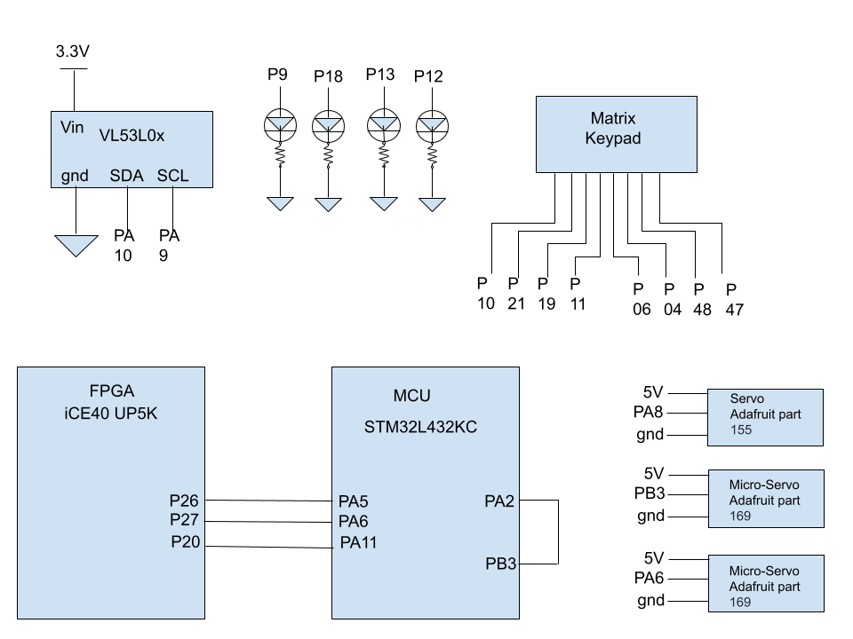

# Schematics
<!-- Include images of the schematics for your system. They should follow best practices for schematic drawings with all parts and pins clearly labeled. You may draw your schematics either with a software tool or neatly by hand. -->

  

| Signal | SDA | SCL | Aiming PWM | Firing PWM | Gate PWM | done | crct pwd | incrct pwd | rows\[3:0\] | cols\[3:0\] | LEDs\[3:0\] | FSM reset |
| ------ | --- | --- | -------- | ------ | -------- | ---- | -------- | -------- | ------- | ----------- | -------- | --- |
| FPGA Pin | | | | | | P26 | P27 | P20 | P47, P10, P21, P11 | P19, P6, P4, P48 | P9, P18, P13, P12 | P43 |
| MCU Pin | PA10 | PA9 | PA8 | PA2 (jumped to PB3) | PA6 | PA5 | PB5 | PA11 | | | | |

# Source Code Overview
<!-- This section should include information to describe the organization of the code base and highlight how the code connects. -->

The source code for the project is located in a Github repository [here](https://github.com/magpyed/E155-FA22-Final-Project/tree/main/src).

# Bill of Materials
<!-- The bill of materials should include all the parts used in your project along with the prices and links.  -->

| Item | Part Number | Quantity | Unit Price | Link |
| ---- | ----------- | ----- | ---- | ---- |
| Adafruit VL53L0X Time of Flight Distance Sensor |  3317 | 1 | $14.95 |  [link](https://www.adafruit.com/product/3317) |
| Adafruit Standard Servo TowerPro SG-5010 | 155 | 1 | $12.00 | [link](https://www.adafruit.com/product/155) |
| Adafruit Micro Servo | 169 | 2 | $5.95 | [link](https://www.adafruit.com/product/169) |

**Total cost: $38.85**
