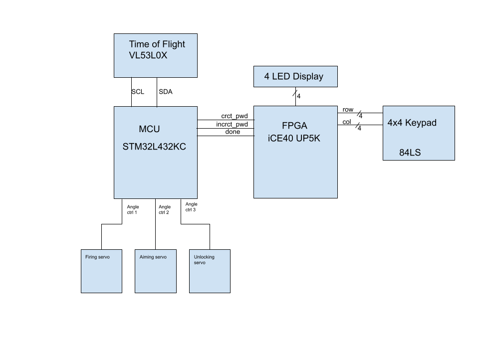

# Project Abstract
We created a 'guarded safe.' As the user approaches the setup, they will notice a water gun being aimed in their direction - the user’s distance from the safe is measured by a time-of-flight sensor. The user interacts with a 4x4 keypad, and enters in a four-digit password. If the password is correct, the safe will open. If the password is incorrect, the water gun will stop aiming and instead fire at the user. Also, LEDs will light up to display the incorrect digits. 

Both the FPGA and the MCU have important tasks to play in our system. The FPGA is responsible for reading in four digits of user input from the keypad and comparing it with a stored password. If there are discrepancies, the FPGA will drive the incrct_pwd line high and illuminate LEDs to represent the wrong inputs. If the password is entirely correct, the FPGA will drive the crct_pwd line high. It then waits for the MCU to finish its routine, and will accept no new keypresses until the done line is pulsed low. 

The MCU, on the other hand, is responsible for communication with the ToF sensor over I2C and controlling servos. It continually collects range data from the VL53L0X peripheral, updates the aiming servo accordingly, and polls its GPIO connections with the FPGA. When either of the incrct/crct_pwd lines is driven high, the MCU will execute the associated routine - firing the gun for incrct, opening the box for crct - then send a low pulse over the done line to the FPGA. 

# System Block Diagram

  

# Project Motivation
The motivation behind the project was threefold. First, create an interactive system that a user could engage with. Second, create a system that uses both the FPGA and MCU for non-trivial tasks. Finally, use a new and interesting piece of hardware. 

# New Hardware
Two new hardware devices were used in the project, Servos and a Time-of-Flight (ToF) Sensor. Servos required a new angle control routine that used timers to send pulses from ~1-2ms in order to control a servo angle between 0-180°. Working with the ToF sensor required two main stages, implementing I2C on the microcontroller and creating routines to set up and run this communication to collect distance data. 
The ToF sensor lacks proper documentation. While the docs detail the process of a single I2C transaction, there is no register mapping that would allow an engineer to create their own driver for the peripheral. Instead, the vendor provides an oversized API - one that we did not want to use, and did not have the time to fully reverse-engineer. We give sincere thanks to the open-source codebase that allowed us to complete communication with the VL53L0X.

